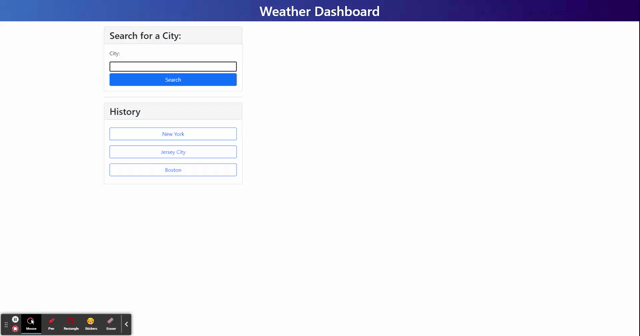

# 06 Server-Side APIs: Weather Dashboard

## Description

This project was to develop a dashboard to allow the user to search a city name and be shown the current weather and a 5 day forecast. When searching, the history of searches should be saved and available as buttons on the side for the user to easily view that location again and be saved and displayed when returning to the page. The weather data for cities was gathered using the [OpenWeather API](https://openweathermap.org/api) and using their Geocoding and One Call API. The page is made using Bootstrap to handle a lot of the styling and much of the page made dynamically with JavaScript and jQuery. Using Bootstrap, the page was built to be responsive and work on mobile and smaller screens.

## User Story

```
AS A traveler
I WANT to see the weather outlook for multiple cities
SO THAT I can plan a trip accordingly
```

## Acceptance Criteria

```
GIVEN a weather dashboard with form inputs
WHEN I search for a city
THEN I am presented with current and future conditions for that city and that city is added to the search history
WHEN I view current weather conditions for that city
THEN I am presented with the city name, the date, an icon representation of weather conditions, the temperature, the humidity, the wind speed, and the UV index
WHEN I view the UV index
THEN I am presented with a color that indicates whether the conditions are favorable, moderate, or severe
WHEN I view future weather conditions for that city
THEN I am presented with a 5-day forecast that displays the date, an icon representation of weather conditions, the temperature, the wind speed, and the humidity
WHEN I click on a city in the search history
THEN I am again presented with current and future conditions for that city
```

The following image demonstrates the application functionality:


## Product

The following is a link to the deployed application: [Weather Dashboard](https://cnohilly.github.io/weather-dashboard/)

The following is a demonstration of the deployed application:
